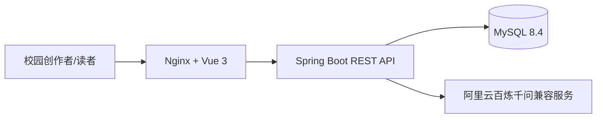
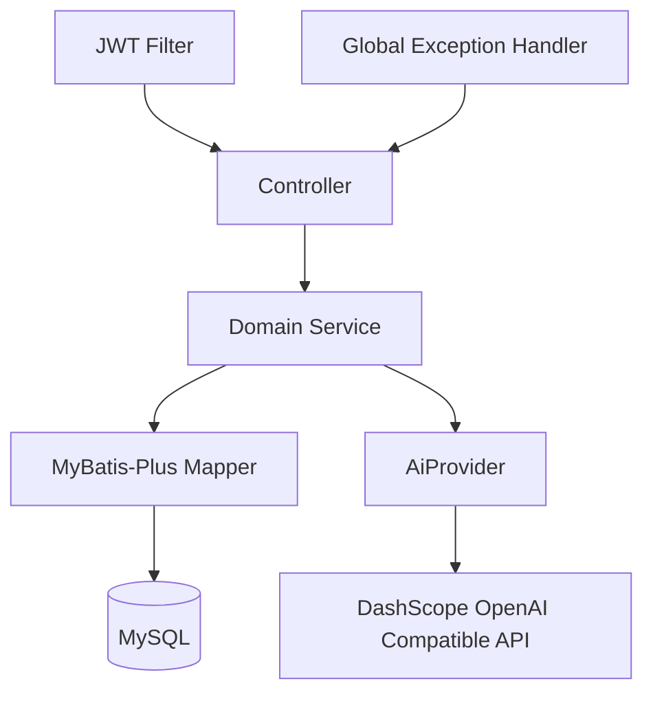
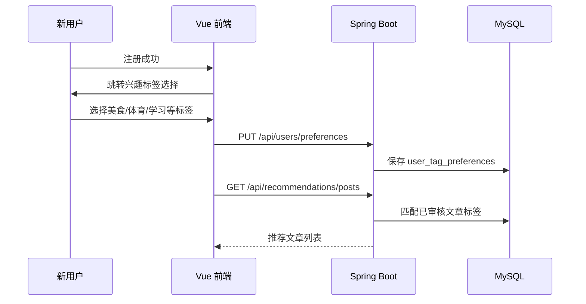
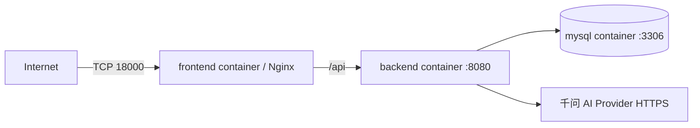

# CampusBlog AI 架构设计

## 设计目标

- 将旧版 Spring Boot 2 + Vue 2 教学项目升级为可部署、可测试、可演示的校园知识博客。
- AI 能力围绕文章生命周期工作，不替代作者决策。
- 外部 AI 服务不可用时，文章 CRUD、搜索、评论和人工元数据保持可用。

## 系统上下文

## 后端组件

- `auth`：注册、登录、BCrypt、JWT。
- `auth`：注册、登录、BCrypt、JWT、用户角色、状态和兴趣标签偏好。
- `post`：文章、标签、搜索、评论、所有权检查和审核可见性。
- `admin`：管理员端帖子审核、成员启用/停用和列表筛选。
- `ai`：供应商抽象、元数据异步生成、写作/问答 SSE、额度和日志。
- `common/security`：统一响应、异常和认证上下文。

## 个性化推荐闭环

推荐规则保持可解释：只按用户兴趣标签与文章标签匹配，不引入隐式画像或跨站数据。

## 部署

公网只暴露前端端口 `18000`。后端和数据库仅通过 Compose 内部网络通信。
