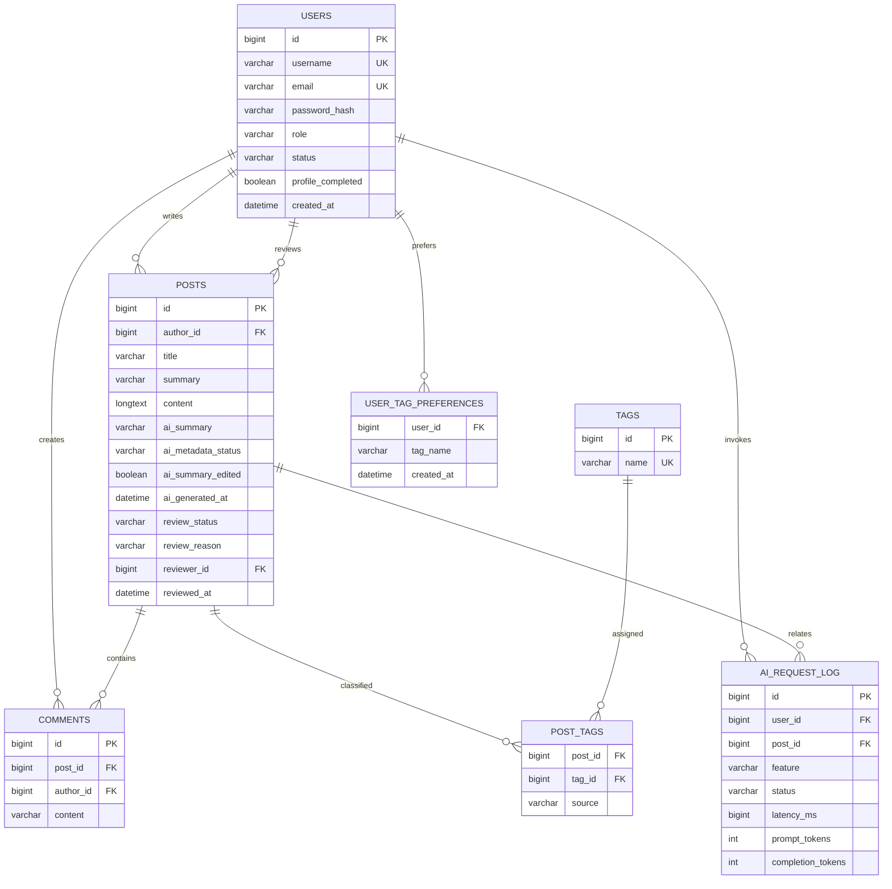

# 数据库设计报告

## E-R 模型

`ai_request_log` 不保存文章正文、问题、提示词、回答、令牌或密码。

## 关键扩展说明

- `users.role`：`ADMIN` 或 `USER`，用于管理员后台访问控制。迁移时会将最早注册用户设置为管理员。
- `users.status`：`ACTIVE` 或 `DISABLED`，停用成员无法登录。
- `users.profile_completed`：标记是否完成注册后的兴趣标签选择。
- `user_tag_preferences`：保存用户显式选择的兴趣标签，推荐页只基于这些标签匹配文章。
- `posts.review_status`：`APPROVED`、`REJECTED`、`HIDDEN`。默认 `APPROVED`，保证原发布体验不被审核流程阻塞。
