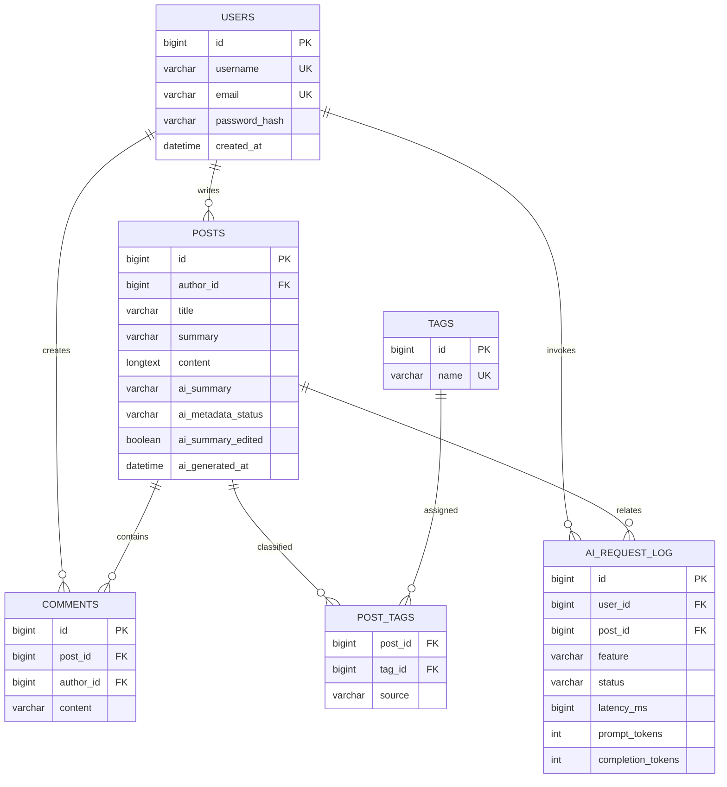

# 数据库设计报告

## E-R 模型

```mermaid
erDiagram
  USERS ||--o{ POSTS : writes
  USERS ||--o{ COMMENTS : creates
  POSTS ||--o{ COMMENTS : contains
  POSTS ||--o{ POST_TAGS : classified
  TAGS ||--o{ POST_TAGS : assigned
  USERS ||--o{ AI_REQUEST_LOG : invokes
  POSTS ||--o{ AI_REQUEST_LOG : relates

  USERS {
    bigint id PK
    varchar username UK
    varchar email UK
    varchar password_hash
    datetime created_at
  }
  POSTS {
    bigint id PK
    bigint author_id FK
    varchar title
    varchar summary
    longtext content
    varchar ai_summary
    varchar ai_metadata_status
    boolean ai_summary_edited
    datetime ai_generated_at
  }
  TAGS {
    bigint id PK
    varchar name UK
  }
  POST_TAGS {
    bigint post_id FK
    bigint tag_id FK
    varchar source
  }
  COMMENTS {
    bigint id PK
    bigint post_id FK
    bigint author_id FK
    varchar content
  }
  AI_REQUEST_LOG {
    bigint id PK
    bigint user_id FK
    bigint post_id FK
    varchar feature
    varchar status
    bigint latency_ms
    int prompt_tokens
    int completion_tokens
  }
```

`ai_request_log` 不保存文章正文、问题、提示词、回答、令牌或密码。

